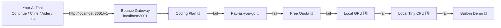

# Bounce Gateway

> **Like a UPS for your AI tools — one endpoint, never down.**

[🇬🇧 English](README.md) | [🇨🇳 中文](README.zh-CN.md) | [🇫🇷 Français](README.fr.md)

[](LICENSE)
[](https://www.python.org/downloads/)

**Bounce Gateway** is a lightweight failover proxy that gives you **one OpenAI-compatible endpoint** for all your AI tools. Configure it once — it auto-fails over when providers run out of quota, hit rate limits, or go down.



---

## 🎯 Core Philosophy: Configure Once, Never Down

**Bounce solves one simple but painful problem: your IDE and AI tools need multiple LLM providers, but you don't want to reconfigure every time one changes.**

```
┌───────────────────────────────────────────────────────────┐
│                 Your IDE / AI Agent                        │
│   TRAE · VS Code · Claude Code · Hermes · Crush · Continue │
└──────────────────────┬────────────────────────────────────┘
                       │  OpenAI format
                       │  http://localhost:3001/v1
                       ▼
┌───────────────────────────────────────────────────────────┐
│                   Bounce Gateway                          │
│                                                           │
│   Coding Plan ─→ Pay-as-you-go ─→ Free ─→ Local GPU ─→ CPU│
│                                                           │
│   Strategy: First 200 wins. Configure once, forget it.    │
└───────────────────────────────────────────────────────────┘
```

**Your IDE is configured once** (point at `localhost:3001/v1`, OpenAI format). Bounce handles the multi-layer failover routing internally. All you do is add providers + paste API keys in Bounce.

> 💡 **You don't need to care whether the backend is DeepSeek or a local model. Bounce unifies the entry point — you only deal with the OpenAI format.**

---

## ✨ Features

- **🔌 One endpoint for all tools** — Point every AI tool at `http://localhost:3001/v1`
- **🔄 Auto failover** — 6 tiers, from cloud plans to local CPU. First 200 wins.
- **🆓 Works immediately** — Built-in demo mode needs no API key. Clone, run, done.
- **🧠 Real local model** — Install Qwen2.5-0.5B (~350MB) for genuine AI offline.
- **📦 Provider templates** — Add DeepSeek, OpenRouter, SiliconFlow, OpenAI in one command.
- **🛡️ Error classification** — Detects 401/402/403/429 per provider — knows a quota error from a rate limit.
- **🔀 Streaming support** — Full SSE streaming with `X-Provider-Id` headers.
- **⚖️ Per-provider timeouts** — No single slow provider blocks the chain.

---

## 🚀 Quick Start

```bash
# 1. Install (or just run from source)
pip install flask requests

# 2. Start the Gateway
bounce-gateway
```

```text
=======================================================
  Bounce Gateway — http://localhost:3001
=======================================================

  ⚠️  No providers configured.
     Install local model: bounce install-local
     Add cloud provider:  bounce provider add <template> --key <key>

    [local_demo     ] Static Demo (fallback) → always available

  📡 POST /v1/chat/completions   ← OpenAI format
  📡 GET  /v1/models              ← Aggregated model list
  📡 GET  /health                  ← Health check
```

**It's running.** No API key, no config — just works.

```bash
# Try it
curl http://localhost:3001/v1/chat/completions \
  -H "Content-Type: application/json" \
  -d '{"model":"demo-model","messages":[{"role":"user","content":"Hello!"}]}'
```

The demo response explains how to add real providers and install a local model.

---

## 🔑 Get Your First API Key (Free)

The easiest way to get started with cloud AI — no credit card required.

### ▶️ For International Users: OpenRouter

[OpenRouter](https://openrouter.ai/auth?ref=llmswitch) gives you:
- **$1 free credits** on signup — covers ~500K tokens of DeepSeek or Gemini
- **400+ models** from 60+ providers under one API key
- **Pay-as-you-go** with no monthly subscription

```bash
# 1. Sign up at: https://openrouter.ai/auth?ref=llmswitch
# 2. Create an API key at: https://openrouter.ai/keys
# 3. Add it to Bounce:
bounce provider add openrouter-payg --key sk-or-v1-your-key-here
bounce provider add openrouter-free --key sk-or-v1-your-key-here
```

> 💡 **One key for all 400+ models.** OpenRouter handles the routing. You get a single bill at the end of the month.

### ▶️ For China Mainland Users: SiliconFlow

[硅基流动 (SiliconFlow)](https://cloud.siliconflow.cn?ref=llmswitch_xbs) offers:
- **14 RMB free quota** on first top-up of 34 RMB
- **DeepSeek V3, Qwen 72B** and other top open-source models
- **Fast inference** on local mainland servers (no VPN needed)

```bash
bounce provider add siliconflow-payg --key sk-your-key-here
bounce provider add siliconflow-free --key sk-your-key-here
```

---

## 🧠 Install a Real Local Model

For genuine AI responses without any API key:

```bash
# Interactive installer — prompts before downloading
bounce install-local
```

Or if you prefer:

```bash
# Direct install
bounce install-local --yes
```

What happens:

1. `pip install llama-cpp-python` (CPU, precompiled wheel)
2. Downloads **Qwen2.5-0.5B-Instruct-Q4_K_M.gguf** (~350MB)
3. Registers it as Tier 5 (`local_tiny`)
4. Restart the Gateway — it now uses a **real AI model**, not a demo

The model runs entirely on CPU, takes ~2-3 seconds per response on modern hardware, and works completely offline.

> 💡 **Already have Ollama?** The installer auto-detects Ollama at `localhost:11434` and configures it instead.

---

## ☁️ Cloud Provider Templates

```bash
# See available templates
bounce provider templates
```

```text
=======================================================
  Provider Templates
=======================================================

  ⭐ Coding Plan (Tier 1):
    deepseek-cp               → https://api.deepseek.com/v1
    huoshan-cp                → https://ark.cn-beijing.volces.com/api/v3

  💰 Pay-as-you-go (Tier 2):
    deepseek-payg             → https://api.deepseek.com/v1
    openai-payg               → https://api.openai.com/v1
    openrouter-payg ★         → https://openrouter.ai/api/v1 (Recommended for intl.)
    siliconflow-payg          → https://api.siliconflow.cn/v1 (Recommended for CN)

  🆓 Free Quota (Tier 3):
    siliconflow-free          → https://api.siliconflow.cn/v1
    openrouter-free           → https://openrouter.ai/api/v1

  🏠 Local (Tier 4):
    qwen27b-direct            → http://192.168.1.100:8080/v1 (llama.cpp)
    qwen35b-uncensored        → http://192.168.1.100:8080/v1 (CPU)
```

Add providers:

```bash
# Add a coding plan (Tier 1 — tried first)
bounce provider add deepseek-cp --key sk-you...-key

# Add a pay-as-you-go backup (Tier 2)
bounce provider add deepseek-payg --key sk-you...-key

# Add OpenRouter (Tier 2) — one key for 400+ models
bounce provider add openrouter-payg --key sk-or-v1...key

# Add a free tier (Tier 3)
bounce provider add openrouter-free --key sk-or-v1...key

# Add a local model (Tier 4) — connects to llama.cpp/Ollama
bounce provider add qwen27b-direct
```

After adding providers, restart the Gateway:

```bash
bounce gateway restart
# or
bounce gateway start
```

---

## 🔗 Integrate Your Tools

All tools that support OpenAI-compatible API connect to **one endpoint**:

| Tool | Configuration |
|------|--------------|
| [TRAE CN](https://docs.trae.cn/ide/models) | Settings > Models > Add > Custom: OpenAI Chat Completions, URL `http://localhost:3001/v1`, model `deepseek-v4-flash`, key `bounce`, series DeepSeek-4 Series |
| [Continue](https://docs.continue.dev/) | `apiBase: "http://localhost:3001/v1"` |
| [Cline](https://github.com/cline/cline) | OpenAI-compatible provider → `http://localhost:3001/v1` |
| [Crush](https://github.com/charmbracelet/crush) | Configure `base_url: "http://localhost:3001/v1"`, `type: "openai-compat"` |
| [Aider](https://aider.chat/) | `export OPENAI_API_BASE=http://localhost:3001/v1` |
| [Hermes Agent](https://hermes-agent.nousresearch.com/) | Add a provider with `base_url: http://localhost:3001/v1` |
| [OpenAI Python SDK](https://pypi.org/project/openai/) | `client = OpenAI(base_url="http://localhost:3001/v1")` |
| [curl](https://curl.se/) | `curl http://localhost:3001/v1/chat/completions ...` |
| [Claude Code](https://docs.anthropic.com/en/docs/claude-code/overview) | Use LiteLLM bridge → Gateway (`litellm --model claude-sonnet-4 --api_base http://localhost:3001/v1`) |

---

## 🏗 Architecture

### The 6-Tier Chain

```
┌──────────────────────────────────────────────────────────┐
│              Bounce Gateway                          │
│  localhost:3001/v1                                       │
├──────────────────────────────────────────────────────────┤
│                                                          │
│  ┌──────────┐                                            │
│  │ Request  │  → DeepSeek CP (Tier 1) ──── 200? ──→ ✅  │
│  │          │    ↓ fail (401/402/timeout)                │
│  │          │  → DeepSeek PAYG (Tier 2) ── 200? ──→ ✅  │
│  │          │    ↓ fail                                  │
│  │          │  → OpenRouter PAYG (Tier 2) ─ 200? ──→ ✅ │
│  │          │    ↓ fail                                  │
│  │          │  → Free Quota (Tier 3) ──── 200? ──→ ✅   │
│  │          │    ↓ fail                                  │
│  │          │  → Local GPU (Tier 4) ────── 200? ──→ ✅  │
│  │          │    ↓ fail                                  │
│  │          │  → Local Tiny CPU (Tier 5) ── 200? ─→ ✅  │
│  │          │    ↓ not installed                         │
│  │          │  → Built-in Demo (Tier 6) ── always ─→ ✅ │
│  └──────────┘                                            │
│                                                          │
│  Strategy: First 200 wins.                               │
│  No health checks — every request is a real probe.       │
└──────────────────────────────────────────────────────────┘
```

Key design decisions:

- **No background health checks** — Every request IS the health check. Adds ~200ms per failed attempt, but avoids stale state and false positives.
- **No Anthropic format** — 90% of tools support OpenAI format. Claude Code goes through LiteLLM bridge.
- **Error classification per provider** — SiliconFlow 403 means "QuotaExhausted". DeepSeek 402 means "insufficient_quota". Anthropic 429 is always rate-limit (no distinction).
- **Streaming pass-through** — SSE streams are forwarded transparently with `X-Provider-Id` header showing which provider served the request.

### Provider Templates

Templates define API endpoints, supported models, timeout, and error patterns for each provider:

```json
{
  "id": "deepseek-cp",
  "name": "DeepSeek Coding Plan",
  "tier": "coding_plan",
  "api_base": "https://api.deepseek.com/v1",
  "models": ["deepseek-chat", "deepseek-reasoner"],
  "timeout": 30,
  "error_map": {
    "auth_failed":     {"status": [401], "body_contains": ["invalid_api_key"]},
    "quota_exhausted": {"status": [402], "body_contains": ["insufficient_quota"]},
    "rate_limited":    {"status": [429], "body_contains": ["rate_limit"]}
  }
}
```

---

## 📦 CLI Reference

```text
Usage:
  bounce list                    List all providers
  bounce use <id>                Switch active provider
  bounce status                  Show current provider
  bounce env                     Show env vars
  bounce doctor                  Check all tool configs
  bounce panel                   Web management panel
  bounce install-local           Install tiny local AI model (CPU)
  bounce gateway <start|stop|status>   Failover gateway
  bounce provider <add|list|templates>  Provider management
```

---

## 🔧 Configuration

Default config at `~/.bounce/config.json`:

```json
{
  "providers": [
    {
      "id": "deepseek-cp",
      "name": "DeepSeek Coding Plan",
      "type": "cloud",
      "tier": "coding_plan",
      "gateway": true,
      "template_id": "deepseek-cp",
      "api_key_env": "DEEPSEEK_CP_KEY",
      "api_base": "https://api.deepseek.com/v1",
      "models": ["deepseek-chat", "deepseek-reasoner"],
      "timeout": 30
    }
  ],
  "gateway": {
    "port": 3001,
    "no_demo": false
  }
}
```

API keys are resolved in this order:

1. `api_key` field in config (if it looks like a real key)
2. `env:<VAR_NAME>` reference (e.g., `"api_key": "env:DEEPSEEK_CP_KEY"`)
3. `api_key_env` field (e.g., `"api_key_env": "DEEPSEEK_CP_KEY"`)
4. Convention: `{UPPERCASE_ID}_KEY` (e.g., `DEEPSEEK_CP_KEY`)

---

## 📋 Requirements

- **Python 3.10+** with `flask` and `requests`
- **~350MB disk** if installing the local model
- **No GPU required** — the built-in model runs on CPU

---

## 🔄 How It Differs

| Feature | One API / LiteLLM | **Bounce Gateway** |
|---------|-------------------|----------------------|
| Philosophy | "Pick a channel" | "Don't let me down" |
| Failover | Manual channel switching | **Automatic chain failover** |
| Local model | Not supported | **Built-in Qwen2.5-0.5B** |
| Demo mode | Needs API key | **Works immediately** |
| Setup complexity | Multiple configs | **One endpoint for all** |
| Error classification | Generic HTTP | **Per-provider patterns** |
| Code size | Large (multi-service) | **~700 lines Python** |

---

## 📜 License

MIT — do whatever you want with it.

---

## 🙏 Acknowledgements

- [Qwen/Qwen2.5-0.5B](https://huggingface.co/Qwen/Qwen2.5-0.5B-Instruct-GGUF) — Tiny but mighty model
- [llama-cpp-python](https://github.com/abetlen/llama-cpp-python) — Local inference backend
- The LLM community for making AI accessible to everyone